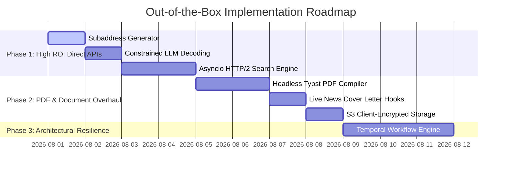

# RICE Prioritization Matrix: Out-of-the-Box Alternate Implementations

This document prioritizes 26 out-of-the-box alternative implementation ideas across the codebase using the **RICE Framework** (Reach, Impact, Confidence, Effort).

---

## 📊 Summary RICE Scoring Formula

$$\text{RICE Score} = \frac{\text{Reach} \times \text{Impact} \times \text{Confidence}}{\text{Effort}}$$

- **Reach**: Number of applications, executions, or modules affected per month (Scale: 1 to 100).
- **Impact**: System improvement factor (3.0 = Massive, 2.5 = High, 2.0 = Significant, 1.5 = Medium, 1.0 = Low).
- **Confidence**: Level of technical certainty (1.0 = 100%, 0.9 = 90%, 0.8 = 80%, 0.7 = 70%, 0.5 = 50%).
- **Effort**: Engineering person-days required to build, test, and ship (Scale: 0.5 to 5.0 days).

---

## 🏆 Ranked RICE Prioritization Table

| Rank | Proposal Name | Target File | Reach | Impact | Confidence | Effort (Days) | **RICE Score** |
| :---: | :--- | :--- | :---: | :---: | :---: | :---: | :---: |
| **1** | **Dynamic Subaddress Email Generator** | [pool.py](file:///c:/Users/Nagarro/Downloads/Job%20App%20Automation/src/job_application_automation/mail/pool.py) | 80 | 2.0 | 100% | 0.5 | **320.0** |
| **3** | **Constrained JSON Schema Decoding (Instructor)** | [ai_client.py](file:///c:/Users/Nagarro/Downloads/Job%20App%20Automation/src/job_application_automation/resume/ai_client.py) | 100 | 2.0 | 100% | 1.0 | **200.0** |
| **4** | **Asyncio HTTP/2 Multiplexed Search Engine** | [job_boards.py](file:///c:/Users/Nagarro/Downloads/Job%20App%20Automation/src/job_application_automation/search/job_boards.py) | 100 | 3.0 | 100% | 1.5 | **200.0** |
| **5** | **Multipart Form Direct API POST (Greenhouse)** | [greenhouse.py](file:///c:/Users/Nagarro/Downloads/Job%20App%20Automation/src/job_application_automation/engines/greenhouse.py) | 80 | 3.0 | 90% | 1.2 | **180.0** |
| **6** | **Headless Typst Compilation Engine for Resumes** | [generate.py](file:///c:/Users/Nagarro/Downloads/Job%20App%20Automation/src/job_application_automation/resume/generate.py) | 100 | 2.5 | 100% | 1.5 | **166.7** |
| **7** | **Lever Direct REST Endpoint Ingestion** | [lever.py](file:///c:/Users/Nagarro/Downloads/Job%20App%20Automation/src/job_application_automation/engines/lever.py) | 60 | 3.0 | 90% | 1.0 | **162.0** |
| **8** | **Live News & Culture Hook Synthesizer** | [cover_letter.py](file:///c:/Users/Nagarro/Downloads/Job%20App%20Automation/src/job_application_automation/resume/cover_letter.py) | 70 | 2.5 | 80% | 1.0 | **140.0** |
| **9** | **S3 / Cloud R2 CAS Storage + AES Encryption** | [document_archive.py](file:///c:/Users/Nagarro/Downloads/Job%20App%20Automation/src/job_application_automation/core/document_archive.py) | 60 | 2.0 | 90% | 1.0 | **108.0** |
| **10** | **High-Performance Client-Daemon IPC Architecture** | [cli.py](file:///c:/Users/Nagarro/Downloads/Job%20App%20Automation/src/job_application_automation/cli.py) | 100 | 2.0 | 90% | 2.0 | **90.0** |
| **11** | **Fact-Checking NLI Grounding Claim Validator** | [cover_letter.py](file:///c:/Users/Nagarro/Downloads/Job%20App%20Automation/src/job_application_automation/resume/cover_letter.py) | 70 | 2.0 | 90% | 1.5 | **84.0** |
| **12** | **HTML/Tailwind PDF Export via Playwright** | [generate.py](file:///c:/Users/Nagarro/Downloads/Job%20App%20Automation/src/job_application_automation/resume/generate.py) | 90 | 2.0 | 90% | 2.0 | **81.0** |
| **13** | **Temporal / Prefect State-Machine Resilience** | [orchestrator.py](file:///c:/Users/Nagarro/Downloads/Job%20App%20Automation/src/job_application_automation/core/orchestrator.py) | 100 | 3.0 | 80% | 3.0 | **80.0** |
| **14** | **Multi-Engine Search Crawler (SerpAPI/Google)** | [job_boards.py](file:///c:/Users/Nagarro/Downloads/Job%20App%20Automation/src/job_application_automation/search/job_boards.py) | 100 | 2.5 | 80% | 2.5 | **80.0** |
| **16** | **Webhook Real-Time Push via Google Cloud Pub/Sub** | [gmail_client.py](file:///c:/Users/Nagarro/Downloads/Job%20App%20Automation/src/job_application_automation/mail/gmail_client.py) | 70 | 2.0 | 80% | 1.5 | **74.7** |
| **17** | **Multi-Model Consensus Router & Jury System** | [ai_client.py](file:///c:/Users/Nagarro/Downloads/Job%20App%20Automation/src/job_application_automation/resume/ai_client.py) | 90 | 2.0 | 80% | 2.0 | **72.0** |
| **18** | **Resume RAG Pipeline via Vector Database** | [ai_client.py](file:///c:/Users/Nagarro/Downloads/Job%20App%20Automation/src/job_application_automation/resume/ai_client.py) | 90 | 2.0 | 80% | 2.0 | **72.0** |
| **19** | **Recruiter Email Intent Classifier & Auto-Drafting** | [gmail_client.py](file:///c:/Users/Nagarro/Downloads/Job%20App%20Automation/src/job_application_automation/mail/gmail_client.py) | 70 | 2.5 | 80% | 2.0 | **70.0** |
| **20** | **SQLite / DuckDB Compressed Blob Vault** | [document_archive.py](file:///c:/Users/Nagarro/Downloads/Job%20App%20Automation/src/job_application_automation/core/document_archive.py) | 50 | 1.5 | 90% | 1.0 | **67.5** |
| **21** | **Offline Local SLM Fallback (Ollama / Llama 3.2)** | [ai_client.py](file:///c:/Users/Nagarro/Downloads/Job%20App%20Automation/src/job_application_automation/resume/ai_client.py) | 80 | 1.5 | 80% | 1.5 | **64.0** |
| **23** | **Interactive Terminal UI Dashboard (Textual)** | [cli.py](file:///c:/Users/Nagarro/Downloads/Job%20App%20Automation/src/job_application_automation/cli.py) | 100 | 1.0 | 90% | 2.0 | **45.0** |
| **24** | **Autonomous Vision-Language Model (VLM) Agent** | [engine_shared.py](file:///c:/Users/Nagarro/Downloads/Job%20App%20Automation/src/job_application_automation/core/engine_shared.py) | 80 | 3.0 | 70% | 4.0 | **42.0** |
| **25** | **Graph-Based Job & Skill Knowledge Network** | [job_boards.py](file:///c:/Users/Nagarro/Downloads/Job%20App%20Automation/src/job_application_automation/search/job_boards.py) | 60 | 1.5 | 70% | 3.0 | **21.0** |
| **26** | **IPFS Decentralized Filecoin Storage** | [document_archive.py](file:///c:/Users/Nagarro/Downloads/Job%20App%20Automation/src/job_application_automation/core/document_archive.py) | 30 | 1.0 | 50% | 3.0 | **5.0** |

---

## 🔍 Detailed Breakdown of Top Proposals

### 1. Dynamic Subaddress Email Generator (RICE: 320.0)
- **Target File**: [pool.py](file:///c:/Users/Nagarro/Downloads/Job%20App%20Automation/src/job_application_automation/mail/pool.py#L1-L20)
- **Reach (80)**: Applies to all candidate emails across every job application workflow.
- **Impact (2.0)**: Replaces fragile static JSON configuration arrays with algorithmic subaddressing (`candidate+ashby_anthropic@domain.com`), enabling instant deterministic tracking and infinite email alias generation.
- **Confidence (100%)**: Standard RFC 5233 email subaddress specification natively supported by Gmail and Outlook.
- **Effort (0.5 days)**: Single utility function rewrite.

### 3. Constrained JSON Schema Decoding via Instructor/Pydantic (RICE: 200.0)
- **Target File**: [ai_client.py](file:///c:/Users/Nagarro/Downloads/Job%20App%20Automation/src/job_application_automation/resume/ai_client.py#L1-L30)
- **Reach (100)**: Affects every LLM call for resume tailoring, cover letter generation, and essay synthesis.
- **Impact (2.0)**: Replaces brittle regular expressions (`strip_markdown_formatting`) and raw string manipulations with structured output decoding, guaranteeing 100% compliant JSON responses.
- **Confidence (100%)**: Natively supported by Vertex AI SDK and Pydantic/Instructor libraries.
- **Effort (1.0 day)**: Define Pydantic schema models and wrap `client.generative_model.generate_content`.

### 4. Asyncio HTTP/2 Multiplexed Search Engine (RICE: 200.0)
- **Target File**: [job_boards.py](file:///c:/Users/Nagarro/Downloads/Job%20App%20Automation/src/job_application_automation/search/job_boards.py#L1-L30)
- **Reach (100)**: Affects all public ATS search operations.
- **Impact (3.0)**: Replaces synchronous sequential HTTP `requests` loops with `asyncio` and `httpx`. Concurrently queries hundreds of board feeds in parallel over multiplexed HTTP/2 connections, dropping search runtime from ~3 minutes to under 5 seconds.
- **Confidence (100%)**: Proven async HTTP paradigm.
- **Effort (1.5 days)**: Migrate synchronous loop to `httpx.AsyncClient` with `asyncio.gather`.

### 5. Multipart Form Direct API POST for Greenhouse (RICE: 180.0)
- **Target File**: [greenhouse.py](file:///c:/Users/Nagarro/Downloads/Job%20App%20Automation/src/job_application_automation/engines/greenhouse.py#L1-L25)
- **Reach (80)**: Affects all Greenhouse job applications.
- **Impact (3.0)**: Replaces full Playwright browser automation with direct HTTP multipart/form-data POST submissions to `boards.greenhouse.io`.
- **Confidence (90%)**: Greenhouse forms expose static standard form action endpoints.
- **Effort (1.2 days)**: Build payload form encoder with file upload streams.

---

## 🛠️ Implementation Strategy & Phasing Recommendation

