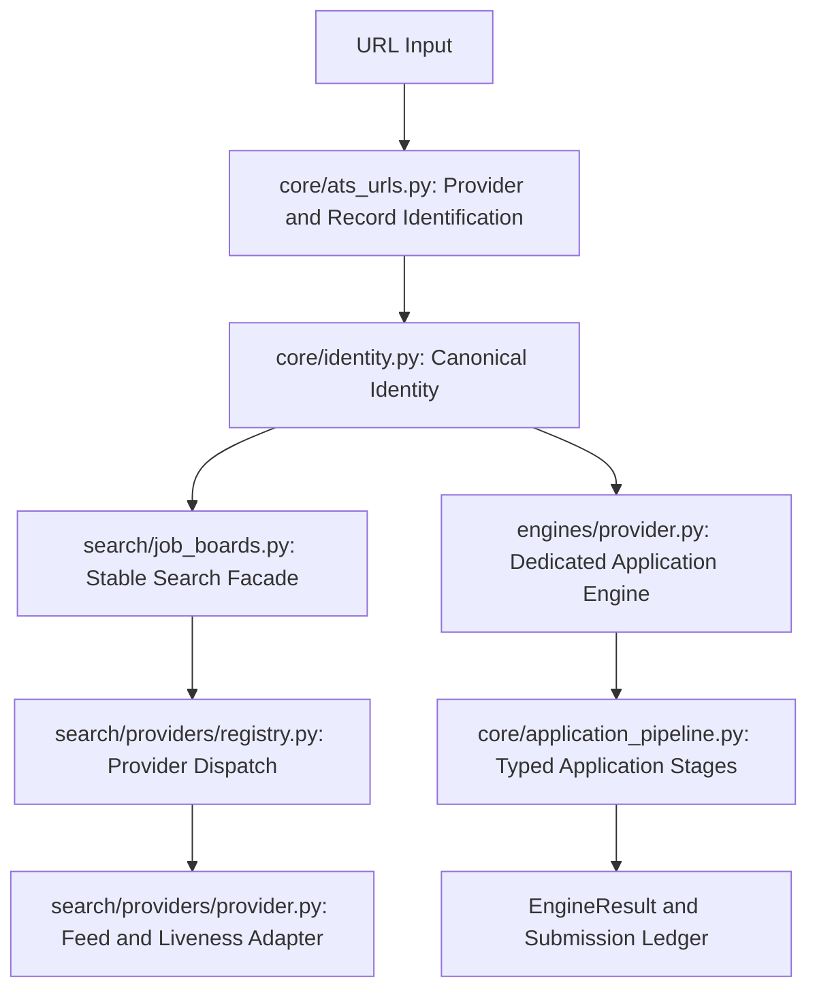
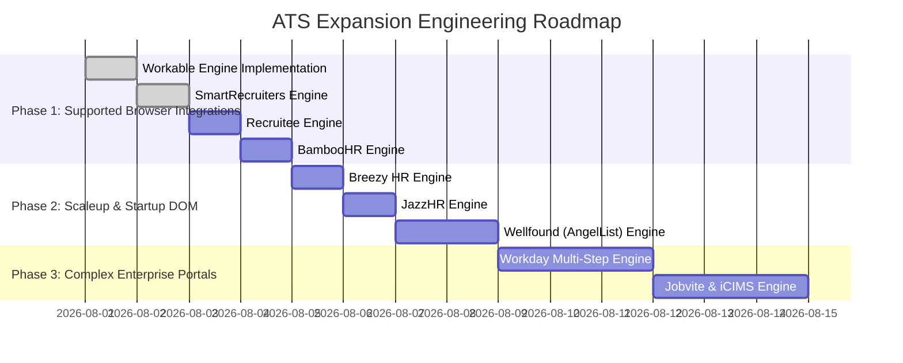

# ATS Automation Feasibility, Technical Changes & RICE Prioritization

This document provides a comprehensive technical feasibility analysis, required codebase modifications, and **RICE Framework prioritization** for extending the `Job Application Automation` platform to support additional Applicant Tracking Systems (ATS).

---

## 1. Executive Summary & ATS Ecosystem Overview

The platform supports **5 ATS engines**: Ashby, Greenhouse, Lever, Workable, and SmartRecruiters. The former Recruitee, BambooHR, Breezy HR, and JazzHR application adapters have been removed. This document preserves the original prioritization analysis; its endpoint ideas and effort estimates are not claims about delivered behavior.

Workable and SmartRecruiters use browser automation. Direct candidate-submission APIs described below remain design options and are not implemented. Generic JSON-LD search can discover some unsupported providers, but those results are not routed to an application engine.

Below is an analysis of **12 additional ATS platforms**, categorized by market segment and technical interaction model:

```mermaid
quadrantChart
    title ATS Automation Technical Landscape
    x-axis Low Technical Complexity --> High Technical Complexity
    y-axis Low Job Market Volume --> High Job Market Volume
    quadrant-1 High Reach / High Complexity (Enterprise Core)
    quadrant-2 High Reach / Low Complexity (High-ROI Expansion)
    quadrant-3 Low Reach / Low Complexity (Quick Wins)
    quadrant-4 Low Reach / High Complexity (Legacy Enterprise)
    "Workable": [0.25, 0.85]
    "SmartRecruiters": [0.35, 0.80]
    "BambooHR": [0.20, 0.70]
    "Workday": [0.90, 0.95]
    "iCIMS": [0.75, 0.75]
    "Jobvite": [0.65, 0.50]
    "Recruitee": [0.15, 0.60]
    "Breezy HR": [0.20, 0.55]
    "JazzHR": [0.15, 0.45]
    "Oracle Taleo": [0.95, 0.40]
    "SAP SuccessFactors": [0.85, 0.50]
    "Wellfound (AngelList)": [0.40, 0.65]
```

### Categorization Matrix

| ATS Platform | Target Market Segment | Primary Technical Architecture | Interaction Mechanism | Feasibility Tier |
| :--- | :--- | :--- | :--- | :--- |
| **Workable** | Tech Scaleups & Mid-Market | Modern React SPA / Public Feed | Public Feed / Browser DOM | **Delivered** |
| **SmartRecruiters** | Enterprise Tech & Global Brands | React SPA / Public Listing API | Public Feed / Browser DOM | **Delivered** |
| **BambooHR** | SMB & Mid-Market | Clean HTML / Form POST | Static DOM / Multipart POST | **Tier 1 (Immediate)** |
| **Recruitee** | EU & Global Tech Startups | Modern SPA / Public REST API | Direct REST API / Single-Page DOM | **Tier 1 (Immediate)** |
| **Breezy HR** | Startups & Small Businesses | Single-Page Web App | Single-Page Playwright DOM | **Tier 1 (Immediate)** |
| **JazzHR** | SMB & Niche Businesses | Static HTML Form | Single-Page Playwright DOM | **Tier 1 (Immediate)** |
| **Wellfound (AngelList)** | Early-Stage Startups & AI | GraphQL / React SPA | Dynamic Playwright DOM | **Tier 2 (High Value)** |
| **Jobvite** | Mid-Market & Enterprise | Multi-Step Dynamic Form | Multi-Step Playwright DOM | **Tier 2 (High Value)** |
| **iCIMS** | Enterprise & Healthcare | Multi-Page Portal / Iframes | Multi-Frame Playwright DOM | **Tier 3 (Complex Enterprise)** |
| **Workday** | Large Enterprise (Fortune 500) | Multi-Step Auth Portal / Custom UI | Account Auth + Multi-Step DOM | **Tier 3 (Complex Enterprise)** |
| **SAP SuccessFactors** | Legacy Enterprise & Industrial | Multi-Step Auth Portal | Session-State Playwright DOM | **Tier 3 (Complex Enterprise)** |
| **Oracle Taleo** | Government & Defense | Multi-Page Legacy Form | Multi-Page Session DOM | **Tier 4 (Low ROI)** |

---

## 2. Standard Codebase Architecture for Adding an ATS Engine

Adding support for any new ATS platform in this repository follows a modular
pattern across provider identity, search, application, and confirmation
boundaries:



### Component Integration Touchpoints:

1. **Provider URL Ownership ([ats_urls.py](../src/job_application_automation/core/ats_urls.py))**:
   Register provider hosts and record-specific path shapes in
   `ATS_HOST_MARKERS` and `ATS_JOB_PATH_PATTERNS`.
2. **Canonical Job Identity ([identity.py](../src/job_application_automation/core/identity.py))**:
   Preserve provider identifiers through the shared canonical URL and lookup
   normalization contracts.
3. **Search Provider Adapter ([search/providers](../src/job_application_automation/search/providers/))**:
   Implement URL recognition, feed normalization, and liveness behavior, then
   register the typed adapter in `registry.py`. `search/job_boards.py` remains
   the compatibility facade and CLI entrypoint.
4. **Engine Implementation ([engines](../src/job_application_automation/engines/))**:
   Create a dedicated provider module exposing `main(argv)` and a typed engine
   function that returns an [EngineResult](../src/job_application_automation/core/contracts.py).
5. **CLI Dispatcher ([cli.py](../src/job_application_automation/cli.py))**:
   Register the engine module lazily in `ENGINE_MODULES`.
6. **Application Pipeline ([application_pipeline.py](../src/job_application_automation/core/application_pipeline.py))**:
   Register the provider with orchestration, preserving typed safety,
   document, execution, confirmation, checkpoint, and cleanup stages.

---

## 3. Required Changes for Each ATS Engine

### 3.1 Workable (`workable.com`)

* **Domain Markers**: `("workable.com", "apply.workable.com")`
* **Search Feed Endpoint**: `GET https://apply.workable.com/api/v1/widget/accounts/{company}/jobs`
* **Application API Endpoint**: `POST https://apply.workable.com/api/v1/accounts/{company}/jobs/{job_id}/candidates`
* **Delivered Integration**:
  1. `core/ats_urls.py` owns Workable hosts and record-path validation.
  2. `search/providers/workable.py` owns public-feed normalization and batched
     liveness checks; `search/providers/registry.py` dispatches to it.
  3. `engines/workable.py` fills the browser form with guarded required-field,
     CAPTCHA, and confirmation checks. Direct REST submission is not
     implemented.
  4. `cli.py`, `core/orchestrator.py`, and the typed application pipeline
     register and execute the provider.

### 3.2 SmartRecruiters (`smartrecruiters.com`)

* **Domain Markers**: `("smartrecruiters.com", "jobs.smartrecruiters.com")`
* **Search Feed Endpoint**: `GET https://api.smartrecruiters.com/v1/companies/{company}/postings`
* **Application API Endpoint**: `POST https://api.smartrecruiters.com/v1/companies/{company}/postings/{job_id}/candidates`
* **Delivered Integration**:
  1. `core/ats_urls.py` owns SmartRecruiters hosts and record-path validation.
  2. `search/providers/smartrecruiters.py` owns public-feed normalization and
     per-record liveness checks; `search/providers/registry.py` dispatches to it.
  3. `engines/smartrecruiters.py` fills the OneClick browser flow and stops
     safely on required fields or anti-bot verification. Direct multipart API
     submission is not implemented.
  4. `cli.py`, `core/orchestrator.py`, and the typed application pipeline
     register and execute the provider.

### 3.3 BambooHR (`bamboohr.com`)

* **Domain Markers**: `("bamboohr.com",)`
* **Application Page**: `https://{company}.bamboohr.com/careers/{job_id}`
* **Changes Required**:
  1. `src/job_application_automation/core/engine_shared.py`: Add `"bamboohr": ("bamboohr.com",)` to `ATS_HOST_MARKERS`.
  2. `src/job_application_automation/engines/bamboohr.py` **[REMOVED / NOT SUPPORTED]**: A future implementation would need to fill known BambooHR form variants and require a successful guarded prefill before submission.
  3. `src/job_application_automation/cli.py`: Register `"bamboohr"` in `ENGINE_MODULES`.
  4. `src/job_application_automation/core/orchestrator.py`: Add `"bamboohr"` to `DEFAULT_ENGINE_FILES`.
  5. Confirmation detection: Match text phrases (`"Application Submitted!"`, `"Thank you for applying to"`).

### 3.4 Recruitee (`recruitee.com`)

* **Domain Markers**: `("recruitee.com",)`
* **Application Endpoint**: `POST https://{company}.recruitee.com/api/v1/offers/{offer_id}/candidates`
* **Changes Required**:
  1. `src/job_application_automation/core/engine_shared.py`: Add `"recruitee": ("recruitee.com",)` to `ATS_HOST_MARKERS`.
  2. `src/job_application_automation/engines/recruitee.py` **[REMOVED / NOT SUPPORTED]**: A future implementation would need to fill current Recruitee browser fields and uploads. Direct multipart API submission is not implemented.
  3. `src/job_application_automation/cli.py`: Add `"recruitee"` to `ENGINE_MODULES`.
  4. `src/job_application_automation/core/orchestrator.py`: Register `"recruitee"`.

### 3.5 Breezy HR (`breezy.hr`)

* **Domain Markers**: `("breezy.hr",)`
* **Application Page**: `https://{company}.breezy.hr/p/{job_id}/apply`
* **Changes Required**:
  1. `src/job_application_automation/core/engine_shared.py`: Add `"breezy": ("breezy.hr",)` to `ATS_HOST_MARKERS`.
  2. `src/job_application_automation/engines/breezy.py` **[REMOVED / NOT SUPPORTED]**: A future implementation would need to fill the current Breezy form controls and guard required questions before submission.
  3. `src/job_application_automation/cli.py` & `orchestrator.py`: Register `"breezy"`.

### 3.6 JazzHR (`applytojob.com`, `jazz.co`)

* **Domain Markers**: `("applytojob.com", "jazz.co")`
* **Changes Required**:
  1. `src/job_application_automation/core/engine_shared.py`: Add `"jazzhr": ("applytojob.com", "jazz.co")` to `ATS_HOST_MARKERS`.
  2. `src/job_application_automation/engines/jazzhr.py` **[REMOVED / NOT SUPPORTED]**: A future implementation would need to fill current `resumator-*` controls and use the provider's anchor-based submit action.
  3. `src/job_application_automation/cli.py` & `orchestrator.py`: Register `"jazzhr"`.

### 3.7 Wellfound / AngelList Jobs (`wellfound.com`)

* **Domain Markers**: `("wellfound.com", "angel.co")`
* **Application Paradigm**: SPA with GraphQL backend (`/graphql`). Requires authentication session cookie or Playwright automated login workflow.
* **Changes Required**:
  1. `src/job_application_automation/core/engine_shared.py`: Add `"wellfound": ("wellfound.com", "angel.co")` to `ATS_HOST_MARKERS`.
  2. `src/job_application_automation/core/profile.py`: Add `wellfound_session_cookie` or login credentials handling.
  3. `src/job_application_automation/engines/wellfound.py` **[NEW]**: Playwright engine managing interactive modal step navigation, custom pitch essay generation, and submission confirmation.
  4. `src/job_application_automation/cli.py` & `orchestrator.py`: Register `"wellfound"`.

### 3.8 Jobvite (`jobvite.com`)

* **Domain Markers**: `("jobvite.com", "jobs.jobvite.com")`
* **Changes Required**:
  1. `src/job_application_automation/core/engine_shared.py`: Add `"jobvite": ("jobvite.com",)` to `ATS_HOST_MARKERS`.
  2. `src/job_application_automation/engines/jobvite.py` **[NEW]**: Multi-step Playwright DOM automation handling wizard pagination (`#jv-apply-next`, `#jv-apply-submit`).
  3. `src/job_application_automation/cli.py` & `orchestrator.py`: Register `"jobvite"`.

### 3.9 iCIMS (`icims.com`)

* **Domain Markers**: `("icims.com",)`
* **Special Challenges**: Embedded cross-origin `<iframe>` containers (`#icims_content_iframe`), candidate login requirement for certain enterprise configurations.
* **Changes Required**:
  1. `src/job_application_automation/core/engine_shared.py`: Add `"icims": ("icims.com",)` to `ATS_HOST_MARKERS`.
  2. `src/job_application_automation/engines/icims.py` **[NEW]**: Frame-aware Playwright engine using `page.frame_locator('#icims_content_iframe')` to traverse step 1 (Email verification), step 2 (Profile creation/resume parse), step 3 (Work experience & questions), step 4 (EEO disclosures).
  3. `src/job_application_automation/cli.py` & `orchestrator.py`: Register `"icims"`.

### 3.10 Workday (`myworkdayjobs.com`)

* **Domain Markers**: `("myworkdayjobs.com", "workday.com")`
* **Special Challenges**: Mandatory user account creation / password prompt (or guest apply mode), complex custom dynamic dropdowns (`[data-automation-id="selectWidget"]`), multi-page wizard flow (5-6 screens), session timeout counters.
* **Changes Required**:
  1. `src/job_application_automation/core/engine_shared.py`: Add `"workday": ("myworkdayjobs.com", "workday.com")` to `ATS_HOST_MARKERS`.
  2. `src/job_application_automation/engines/workday.py` **[NEW]**: Robust multi-step Playwright wizard engine:
     - *Step 1*: Account Registration / Sign In or Guest Apply button (`[data-automation-id="createAccountSubmitButton"]`).
     - *Step 2*: My Information (`[data-automation-id="legalNameSection"]`, resume file drop zone).
     - *Step 3*: My Experience (Work history, education array inputs).
     - *Step 4*: Application Questions (Dynamic ARIA dropdowns & radiogroups).
     - *Step 5*: Voluntary Disclosures (EEO, Veteran, Disability).
     - *Step 6*: Review & Final Submit (`[data-automation-id="bottom-navigation-next-button"]`).
  3. `src/job_application_automation/cli.py` & `orchestrator.py`: Register `"workday"`.

### 3.11 SAP SuccessFactors (`jobs.sap.com`, `successfactors.com`)

* **Domain Markers**: `("successfactors.com", "jobs.sap.com")`
* **Changes Required**:
  1. `src/job_application_automation/core/engine_shared.py`: Add `"successfactors"` to `ATS_HOST_MARKERS`.
  2. `src/job_application_automation/engines/successfactors.py` **[NEW]**: Multi-page portal automation engine handling account creation, tabular experience entry, and form submission.

### 3.12 Oracle Taleo (`taleo.net`, `oraclecloud.com`)

* **Domain Markers**: `("taleo.net", "oraclecloud.com")`
* **Special Challenges**: Legacy table layout DOM, strict 15-minute session timeout, mandatory user account setup.
* **Changes Required**:
  1. `src/job_application_automation/core/engine_shared.py`: Add `"taleo"` to `ATS_HOST_MARKERS`.
  2. `src/job_application_automation/engines/taleo.py` **[NEW]**: Legacy wizard step parser & form automation script with automatic keep-alive ping.

---

## 4. RICE Prioritization Analysis

### RICE Framework Methodology

Each proposed ATS engine implementation is evaluated across 4 key dimensions:

$$\text{RICE Score} = \frac{\text{Reach} \times \text{Impact} \times \text{Confidence}}{\text{Effort}}$$

* **Reach**: Estimated percentage of target job postings accessible in the global tech market (Scale: 1 to 100).
* **Impact**: Throughput and reliability improvement factor (3.0 = Massive, 2.5 = High, 2.0 = Significant, 1.5 = Medium, 1.0 = Low).
* **Confidence**: Technical feasibility, API stability, anti-bot bypass certainty (1.0 = 100%, 0.9 = 90%, 0.8 = 80%, 0.7 = 70%, 0.5 = 50%).
* **Effort**: Engineering person-days required to build, test, and ship (Scale: 0.5 to 5.0 days).

---

### Ranked RICE Prioritization Table

*(Includes current baseline engines + 12 candidate ATS engines)*

| Rank | ATS Engine / Proposal | Target Engine File | Reach (1-100) | Impact (1.0-3.0) | Confidence (%) | Effort (Days) | **RICE Score** | Tier / Status |
| :---: | :--- | :--- | :---: | :---: | :---: | :---: | :---: | :--- |
| **Baseline** | **Ashby (Direct GraphQL POST)** | [ashby.py](../src/job_application_automation/engines/ashby.py) | 80 | 3.0 | 100% | 1.0 | **240.0** | Delivered (Optimization) |
| **Baseline** | **Greenhouse (Multipart API POST)** | [greenhouse.py](../src/job_application_automation/engines/greenhouse.py) | 80 | 3.0 | 90% | 1.2 | **180.0** | Delivered (Optimization) |
| **1** | **Workable Engine** | `engines/workable.py` | 85 | 3.0 | 95% | 1.0 | **242.3** | Delivered (browser) |
| **2** | **SmartRecruiters Engine** | `engines/smartrecruiters.py` | 80 | 3.0 | 90% | 1.2 | **180.0** | Delivered (browser) |
| **3** | **BambooHR Engine** | `engines/bamboohr.py` | 70 | 2.5 | 95% | 1.0 | **166.3** | Removed / not supported |
| **4** | **Recruitee Engine** | `engines/recruitee.py` | 60 | 2.5 | 95% | 0.8 | **178.1** | Removed / not supported |
| **5** | **Breezy HR Engine** | `engines/breezy.py` | 55 | 2.0 | 90% | 0.8 | **123.8** | Removed / not supported |
| **6** | **JazzHR Engine** | `engines/jazzhr.py` | 45 | 2.0 | 90% | 0.8 | **101.3** | Removed / not supported |
| **7** | **Workday Engine** | `engines/workday.py` | 95 | 3.0 | 70% | 2.5 | **79.8** | **Tier 2 (High Value)** |
| **8** | **Wellfound (AngelList) Engine** | `engines/wellfound.py` | 65 | 2.5 | 80% | 1.8 | **72.2** | **Tier 2 (High Value)** |
| **9** | **Jobvite Engine** | `engines/jobvite.py` | 50 | 2.0 | 85% | 1.5 | **56.7** | **Tier 2 (High Value)** |
| **10** | **iCIMS Engine** | `engines/icims.py` | 75 | 2.5 | 70% | 2.5 | **52.5** | **Tier 3 (Complex Enterprise)** |
| **11** | **SAP SuccessFactors Engine** | `engines/successfactors.py` | 50 | 2.0 | 70% | 2.5 | **28.0** | **Tier 3 (Complex Enterprise)** |
| **12** | **Oracle Taleo Engine** | `engines/taleo.py` | 40 | 1.5 | 60% | 3.0 | **12.0** | **Tier 4 (Low ROI)** |

---

## 5. Detailed Breakdown of High-Priority Candidate ATS Engines

### 1. Workable Engine (RICE Score: 242.3; delivered)
* **Target File**: [workable.py](../src/job_application_automation/engines/workable.py)
* **Reach (85)**: Workable is used by thousands of growing tech companies globally.
* **Delivered Scope**: Public-feed discovery, batched liveness checks, and a
  guarded browser application engine. The direct candidate-submission API
  remains an unimplemented design option.

### 2. SmartRecruiters Engine (RICE Score: 180.0; delivered)
* **Target File**: [smartrecruiters.py](../src/job_application_automation/engines/smartrecruiters.py)
* **Reach (80)**: Widely used by enterprise technology brands (Visa, Ubisoft, LinkedIn partners).
* **Delivered Scope**: Public-feed discovery, per-record liveness checks, and a
  guarded browser application engine. Direct API submission remains an
  unimplemented design option.

### 3. Recruitee Engine (RICE Score: 178.1; removed)
* **Former Target File**: `engines/recruitee.py` (removed)
* **Reach (60)**: Core ATS for European and international tech startups.
* **Impact (2.5)**: High reliability API submission endpoint (`POST /api/v1/offers/{offer_id}/candidates`).
* **Confidence (95%)**: Very clean REST architecture.
* **Effort (0.8 days)**: Rapid implementation.

### 4. BambooHR Engine (RICE Score: 166.3; removed)
* **Former Target File**: `engines/bamboohr.py` (removed)
* **Reach (70)**: Prevalent across mid-market tech and US SMBs.
* **Impact (2.5)**: Clean HTML forms enable robust 100% Playwright DOM auto-fill with zero dynamic ARIA obstacles.
* **Confidence (95%)**: Highly stable static element IDs (`#firstName`, `#lastName`, `#email`, `#resume`).
* **Effort (1.0 day)**: Standard Playwright DOM engine.

### 5. Workday Engine (RICE Score: 79.8)
* **Target File**: `engines/workday.py` (planned; not currently present)
* **Reach (95)**: Highest reach among Fortune 500 corporations (Adobe, Salesforce, Target, Walmart).
* **Impact (3.0)**: Automates the most painful, multi-step application workflow in the job market.
* **Confidence (70%)**: Lower technical confidence due to frequent DOM schema updates, mandatory user registration screens, dynamic ARIA drop-downs, and anti-bot checks.
* **Effort (2.5 days)**: Multi-step wizard automation with account state management.

---

## 6. Implementation Roadmap & Phasing Plan

This roadmap is retained as historical prioritization context. Recruitee, BambooHR, Breezy HR, and JazzHR are not current delivery commitments and have no registered application engines.



---

## 7. Conclusion & Recommended Next Steps

1. **Maintain the Supported Baseline**:
   Keep application routing and regression coverage focused on **Ashby**, **Greenhouse**, **Lever**, **Workable**, and **SmartRecruiters**. Reintroducing any removed provider requires a new implementation and validation decision.

2. **Enterprise Expansion (Phase 2)**:
   Prioritize the **Workday Engine** to unlock enterprise applications, utilizing Playwright step-by-step state machines to manage account credentials and multi-page wizard navigation.
